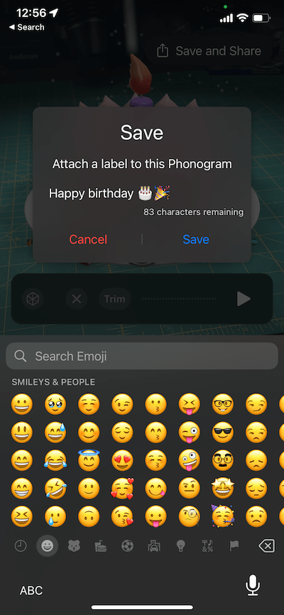

    

    

Phonogram is an iOS app for creating and sharing short audio messages with unique augmented reality effects. The app is [available for free on the App Store][app].

This document covers the basics of using Phonogram. If you run into any issues or have any feature requests, you can also [file an issue][issues] here.

# Using Phonogram

Phonogram lets you record short audio messages with unique augmented reality effects that respond to the audio. You can share these messages with friends and family.

Phonogram is a little different than other apps you might have used. Some things to know before getting started:

- Phonogram is about sharing AR effects, not images or videos of the effects. Recordings are played by placing the AR effect in the world.

- Phonogram is not a social network. We are designed for personal communication. For sharing, we leverage existing tools like iMessage.

With that in mind, let's take a look at the two main ways you can use Phonogram:

1. [Creating and sharing recordings](#creating-and-sharing-recordings)
2. [Receiving and playing back recordings](#receiving-and-playing-recordings). For this you don't even need to install the app!

## Creating and sharing recordings

First [install Phonogram][app]. The app is available for iOS and iPad for devices running iOS 16.4+. After you launch the app, we will walk you though some simple permissions requests. We need access to the camera for augmenting reality and the microphone for recording audio messages.

### Placing

To create a recording, first you need to find a spot for the augmented reality effect the world. We let you place the augmented reality effects on a flat horizontal or vertical surface. The app will walk you through the placement process.

A set of circles shows where the effect will be placed:

    

If you don't see this placement preview, it likely means that the app has not yet detected the surface you are looking at. To help with detection:

- Make sure you are trying to place the visualizer on a relatively flat surface. Very rough or holey surfaces may not be detected. 
- Try moving the device around while keeping it aimed at the surface. On devices without a LiDAR sensor, this helps with surface detection.
- Make sure there is enough light for the cameras. Surface detection struggles in low light scenes.
- Use a surface that has some visual details. Surface detection struggles when pointed at solid color surfaces, such as solid white walls.

> 🎵 **Note**: While placing, pinch pinch to scale the effect up and down. These controls also work after you have placed the effect.

Once you are happy with the effect's location, tap the `Place Effect` button to continue. You can return the to placement view at any time to change the effect's position. You can also tap and drag in the main app view to reposition the effect.

### Selecting and customizing effects

Phonogram includes a number of different AR effects. Every effect responds to the audio in some way and most effects can also be customized.

A list of effects is shown at the bottom of the screen in circles icons. The currently selected effect is shown in the center of the screen:

    

Tap and drag left or right on these effects to scroll though them. The effects change automatically as you scroll.

To customize the current effect, just tap the pencil icon on it:

    

These customizations are stored with it when you save and share it

### Creating a recording

To create a new audio recording, tap the large "record" button at the bottom of the screen. Recordings can be up to 30 seconds in length. Tap the stop button to end the current recording.

    

After making a recording you can play it back with the play button. You can also press `Trim` to edit the start and end of the recording

    

After you make a recording, the current visualizer will respond to its audio. You can also continue to change and customize the AR effect.

### Sharing a recording

Once you are happy with the audio and AR effect, press the `Save and Share` button at the top of the screen:

    

This will first ask you for an optional message to attach to the recording. If you're sending a birthday message, maybe include a little cake emoji. The contents of this message are entirely up to you.

    

After you press `save`, the recording will be saved to your device. At this point we also upload the recording so that you can share it with friends and family.

We recommend using iMessage to share recordings. However recordings are just simple urls so you can share them however you'd like.

> 🎵 **Note**: Keep in mind that anyone with the url will be able to play the recording so be careful about who you share it with. Also remember that you can only [play back](#receiving-and-playing-recordings) the recording on an iPhone or iPad.

### Viewing saved and received recordings

In the main app view, tap the files icon in the top left corner to see a list of all recordings you have saved and received:

    

The `Created` view shows you every recording that you have saved. Tap on one to play it or share it again.

The `Received` view shows all recordings that you have opened. Tap on one to play it. 

## Receiving and playing recordings

Playing a Phonogram recording is easy, you don't even need to install the app to get started!

### Playing back from iMessage

Phonograms received over iMessage will show as a large card:

    

Tap the `Open` button to launch it. If you have Phonogram installed, this will launch the main app. Otherwise this will download and launch an [app clip](https://developer.apple.com/app-clips/). App clips are like temporary little apps that let you run simplified tasks from the main app.

After opening the clip, you can view it again in the `Received` section of your files. Tap the files button to view this:

    

### Playing back from a url

To playback an Phonogram you received outside of iMessage, open its url in Safari on your iPhone or iPad. At the top of the page, you should see an `Open` button to launch the app:

    

Again this will either launch the full app if you have it installed or launch as an app clip.

# Feedback

Love Phonogram? Be sure to tell your friends about it. If you are feeling especially generous, please also write an App Store review. This really helps other people find the app.

Run into a bug or want to request a new feature? Just [file an issue][issues]!

[app]: https://apps.apple.com/us/app/phonogramAR/id1612192523
[issues]: https://github.com/mattbierner/phonogram-support/issues
